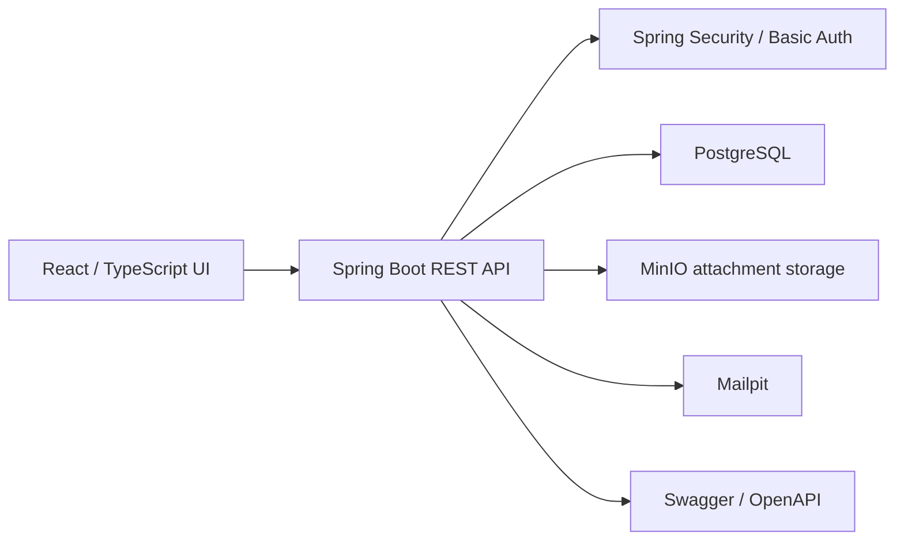

# Modern Workflow Demo

Java 21、Spring Boot、React、TypeScript、PostgreSQL、MinIO、Playwright で構築した、日本企業の社内ワークフローを想定した demo アプリケーションです。

[English README](README.md)

## 概要

このプロジェクトは、社内申請・承認業務を題材にしたポートフォリオ用 demo です。

日本企業の業務システムでよく使われる、申請書、承認ルート、社員マスタ、添付ファイル、承認履歴といった要素を、モダンな Java + React 構成で再実装しています。古い画面をピクセル単位で再現することではなく、業務ロジックとデータ設計を理解していることを示すことが目的です。

## 想定シナリオ

この demo では、申請者から承認者までの一連の流れを確認できます。

1. 申請者が demo アカウントでログインします。
2. 申請書定義を選択します。
3. 動的フォームに入力し、下書きとして保存します。
4. 添付ファイルをアップロードし、申請を提出します。
5. システムが承認ルートを解決し、承認タスクを作成します。
6. 承認者がログインし、申請内容を確認して承認または否認します。
7. 申請詳細、承認ルート、添付ファイル、承認履歴を確認できます。

また、管理者向けの画面として、社員マスタ、申請書定義、ワークフロー定義も用意しています。

## 主な機能

- 申請者・承認者 demo ユーザーによる Basic Auth ログイン
- 現在ユーザー API: `GET /api/me`
- 社員、組織、役職マスタの表示
- 申請書定義の一覧、プレビュー、編集
- ワークフロー定義の一覧、ルートプレビュー、React Flow エディタ、下書き保存、公開
- バックエンドの項目定義に基づく動的申請フォーム
- 下書き保存と申請提出
- 申請者の申請一覧と申請詳細
- 承認者の確認待ちタスク一覧
- 承認・否認処理
- 承認履歴
- 添付ファイルアップロードと一覧表示
- 承認ルート可視化
- 申請提出時のワークフローバージョン固定
- Swagger / OpenAPI ドキュメント
- JUnit / MockMvc によるバックエンドテスト
- Playwright による主要フローの E2E テスト

## スクリーンショット

### ダッシュボード


### 申請者フロー


### ワークフローエディタ


## 技術スタック

| 領域 | 技術 |
| --- | --- |
| Backend | Java 21, Spring Boot 3.5, Spring Security, Spring Data JPA, Hibernate, Flyway |
| Frontend | React, TypeScript, Vite, TanStack Query, React Flow, lucide-react |
| Database / Infra | PostgreSQL 17, MinIO, Mailpit, Docker Compose |
| API Docs | springdoc-openapi, Swagger UI |
| Test | JUnit 5, Spring Boot Test, MockMvc, H2 PostgreSQL mode, Playwright |

## アーキテクチャ



主なバックエンドモジュール:

- `auth`: demo ユーザーと現在ユーザーの解決
- `masterdata`: 社員、組織、役職マスタ
- `formdefinition`: 申請書定義と動的項目
- `workflow`: ワークフロー定義、バージョン、ノード、エッジ、承認ルート解決
- `application`: 下書き作成、申請提出、詳細、入力値スナップショット
- `approval`: 承認タスク、承認・否認、承認履歴
- `attachment`: 添付ファイル metadata と MinIO 互換ストレージ

## データ設計のポイント

主な業務テーブル:

- `employees`, `organizations`, `positions`
- `application_form_definitions`, `application_form_fields`
- `workflow_definitions`, `workflow_versions`, `workflow_nodes`, `workflow_edges`
- `workflow_applications`, `application_field_values`
- `approval_tasks`, `approval_histories`
- `application_attachments`

申請提出時にワークフローバージョンを申請データへ保存します。これにより、後から管理者が承認ルートを変更しても、過去の申請が当時のルートで確認できます。

## ローカル起動

インフラサービスを起動します。

```bash
docker compose -f infra/docker-compose.yml up -d
```

バックエンドを起動します。

```bash
cd backend
./mvnw spring-boot:run
```

フロントエンドを起動します。

```bash
cd frontend
npm run dev
```

アクセス先:

- Frontend: `http://localhost:5173/`
- Backend health: `http://localhost:8080/api/health`
- Swagger UI: `http://localhost:8080/swagger-ui/index.html`
- OpenAPI JSON: `http://localhost:8080/v3/api-docs`
- MinIO console: `http://localhost:9001`
- Mailpit: `http://localhost:8025`

Vite が `::1` のみで待ち受ける場合は、`http://127.0.0.1:5173/` ではなく `http://localhost:5173/` を使用してください。

## Demo アカウント

| Role | Username | Password | Employee |
| --- | --- | --- | --- |
| Applicant | `demo1@growtea.co.jp` | `demo1001` | `山田 太郎` |
| Approver | `demo5@growtea.co.jp` | `demo1005` | `岩瀬 大樹` |

## API ドキュメント

公開エンドポイント:

- `GET /api/health`
- `GET /api/master-data/employees`
- `GET /api/master-data/organizations`
- `GET /api/master-data/positions`
- `GET /api/form-definitions`
- `GET /api/form-definitions/{formCode}`
- `GET /api/workflow-definitions`
- `GET /api/workflow-definitions/{workflowCode}`

Basic Auth が必要なエンドポイント:

- `GET /api/me`
- `GET /api/applications`
- `POST /api/applications/drafts`
- `GET /api/applications/{id}`
- `POST /api/applications/{id}/submit`
- `POST /api/applications/{id}/attachments`
- `GET /api/applications/{id}/attachments`
- `GET /api/applications/{id}/history`
- `GET /api/approval-tasks/pending`
- `POST /api/approval-tasks/{id}/approve`
- `POST /api/approval-tasks/{id}/reject`
- `POST /api/form-definitions`
- `POST /api/workflow-definitions/{workflowCode}/draft`
- `POST /api/workflow-definitions/{workflowCode}/publish`

## 検証

Backend:

```bash
cd backend
./mvnw test
```

Frontend:

```bash
cd frontend
npm run lint
npm run build
```

End-to-end:

```bash
cd frontend
npm run e2e
```

E2E テストは、Spring Boot backend が `http://localhost:8080` で起動している前提です。

## 現在の完成範囲

このプロジェクトは、ポートフォリオ用 demo としては一通り完成しています。

- 申請者フロー
- 承認者フロー
- ワークフロー設定
- マスタデータ
- 添付ファイルアップロード
- 承認履歴
- API ドキュメント
- 自動テスト

## 今後の改善案

- demo Basic Auth から本番想定の認証・権限管理へ変更
- 添付ファイルのダウンロード API と権限制御
- 申請一覧のページング、絞り込み、検索
- Mailpit を使ったメール通知
- 差戻し処理と承認コメントの拡張
- 条件分岐や多段承認など、より高度なワークフロー検証
- 申請書定義、ワークフロー定義の管理者操作履歴
