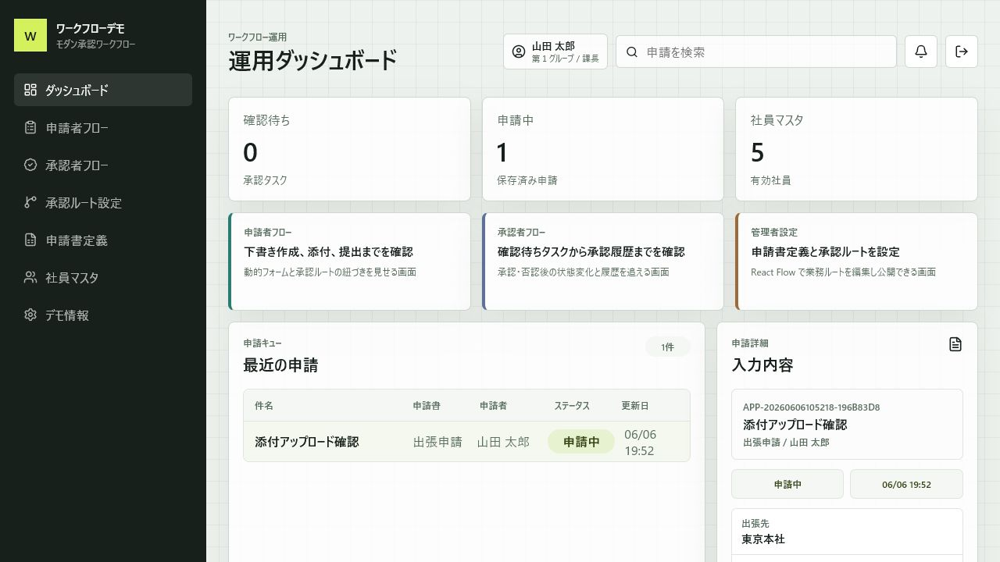
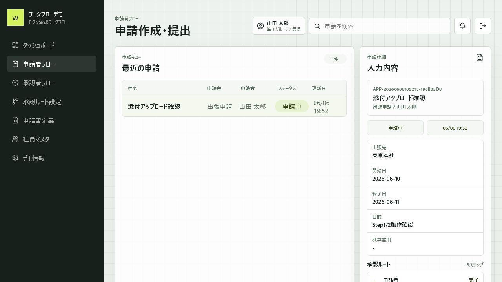
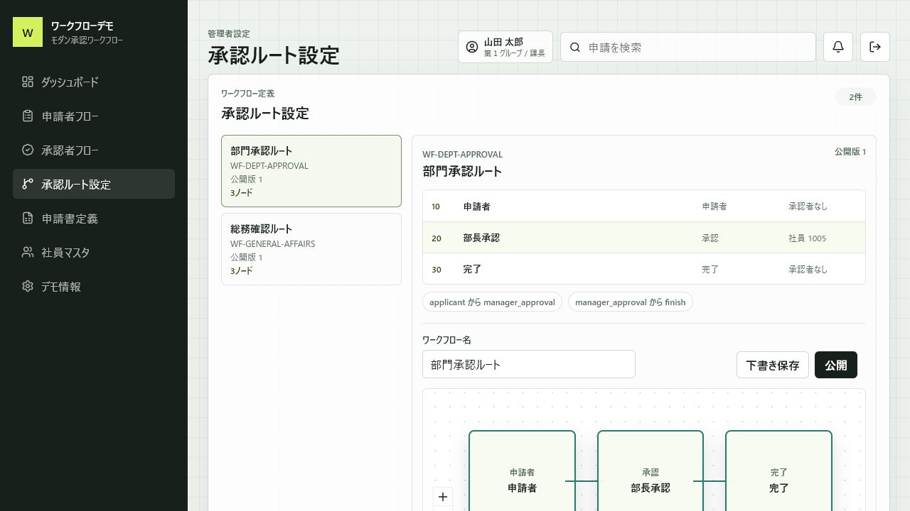
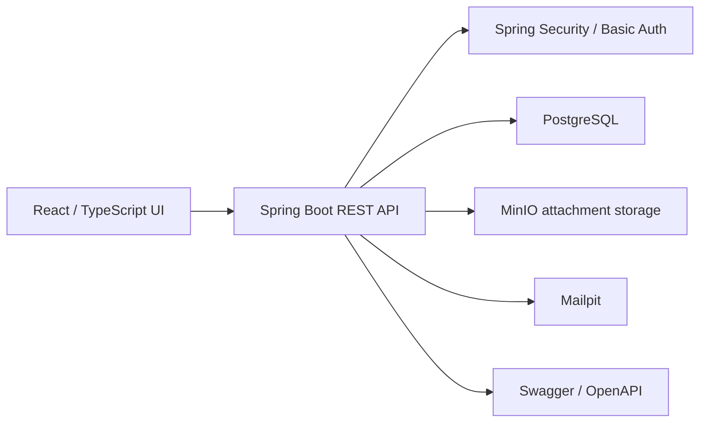

# Modern Workflow Demo

Modern internal workflow approval demo for Japanese business scenarios, built with Java 21, Spring Boot, React, TypeScript, PostgreSQL, MinIO, and Playwright.

[日本語版 README](README.ja.md)

## Overview

This project is a portfolio-ready demo of an internal approval workflow system.

It focuses on the kind of workflow products often used inside Japanese companies: application forms, approval routes, employee master data, file attachments, and approval history. The goal is not to clone an old UI pixel by pixel, but to rebuild the same business ideas with a modern Java and React stack.

## Demo Scenario

The application covers a complete applicant-to-approver flow:

1. Applicant logs in with a demo account.
2. Applicant chooses an application form definition.
3. Applicant fills a dynamic form and saves it as a draft.
4. Applicant uploads an attachment and submits the application.
5. The system resolves the approval route and creates a pending approval task.
6. Approver logs in, reviews the request, and approves or rejects it.
7. Applicant and approver can review the application detail, route, attachments, and approval history.

Admin-oriented screens are also included for master data, application form definitions, and workflow route definitions.

## Features

- Demo Basic Auth login for applicant and approver users
- Current-user API: `GET /api/me`
- Employee, organization, and position master-data views
- Application form definition list, preview, and editor
- Workflow definition list, route preview, React Flow editor, draft save, and publish
- Dynamic new-application form based on backend field definitions
- Draft save and submit transition
- Applicant application list and detail view
- Pending approval task list for approvers
- Approve and reject actions
- Approval history
- Attachment upload and attachment list
- Approval route visualization
- Workflow version snapshot stored on submitted applications
- Swagger / OpenAPI documentation
- JUnit / MockMvc backend tests
- Playwright E2E test for the main workflow

## Screenshots

### Dashboard



### Applicant Flow



### Workflow Editor



## Tech Stack

| Area | Stack |
| --- | --- |
| Backend | Java 21, Spring Boot 3.5, Spring Security, Spring Data JPA, Hibernate, Flyway |
| Frontend | React, TypeScript, Vite, TanStack Query, React Flow, lucide-react |
| Database / Infra | PostgreSQL 17, MinIO, Mailpit, Docker Compose |
| API Docs | springdoc-openapi, Swagger UI |
| Test | JUnit 5, Spring Boot Test, MockMvc, H2 PostgreSQL mode, Playwright |

## Architecture



Main backend modules:

- `auth`: demo user context and current-user resolution
- `masterdata`: employee, organization, and position master data
- `formdefinition`: application form definitions and dynamic fields
- `workflow`: workflow definitions, versions, nodes, edges, and route resolution
- `application`: draft creation, submit transition, detail, field-value snapshots
- `approval`: pending tasks, approve/reject actions, and approval history
- `attachment`: upload metadata and MinIO-compatible storage

## Database Concepts

Important business tables:

- `employees`, `organizations`, `positions`
- `application_form_definitions`, `application_form_fields`
- `workflow_definitions`, `workflow_versions`, `workflow_nodes`, `workflow_edges`
- `workflow_applications`, `application_field_values`
- `approval_tasks`, `approval_histories`
- `application_attachments`

Submitted applications store a workflow version snapshot. This prevents old applications from being affected when an admin publishes a new approval route later.

## Running Locally

Start the infrastructure services:

```bash
docker compose -f infra/docker-compose.yml up -d
```

Run the backend:

```bash
cd backend
./mvnw spring-boot:run
```

Run the frontend:

```bash
cd frontend
npm run dev
```

Open:

- Frontend: `http://localhost:5173/`
- Backend health: `http://localhost:8080/api/health`
- Swagger UI: `http://localhost:8080/swagger-ui/index.html`
- OpenAPI JSON: `http://localhost:8080/v3/api-docs`
- MinIO console: `http://localhost:9001`
- Mailpit: `http://localhost:8025`

If Vite only listens on `::1`, use `http://localhost:5173/` instead of `http://127.0.0.1:5173/`.

## Demo Accounts

| Role | Username | Password | Employee |
| --- | --- | --- | --- |
| Applicant | `demo1@example.local` | `demo1001` | `山田 太郎` |
| Approver | `demo5@example.local` | `demo1005` | `岩瀬 大樹` |

## API Documentation

Public endpoints:

- `GET /api/health`
- `GET /api/master-data/employees`
- `GET /api/master-data/organizations`
- `GET /api/master-data/positions`
- `GET /api/form-definitions`
- `GET /api/form-definitions/{formCode}`
- `GET /api/workflow-definitions`
- `GET /api/workflow-definitions/{workflowCode}`

Basic Auth endpoints:

- `GET /api/me`
- `GET /api/applications`
- `POST /api/applications/drafts`
- `GET /api/applications/{id}`
- `POST /api/applications/{id}/submit`
- `POST /api/applications/{id}/attachments`
- `GET /api/applications/{id}/attachments`
- `GET /api/applications/{id}/history`
- `GET /api/approval-tasks/pending`
- `POST /api/approval-tasks/{id}/approve`
- `POST /api/approval-tasks/{id}/reject`
- `POST /api/form-definitions`
- `POST /api/workflow-definitions/{workflowCode}/draft`
- `POST /api/workflow-definitions/{workflowCode}/publish`

## Validation

Backend:

```bash
cd backend
./mvnw test
```

Frontend:

```bash
cd frontend
npm run lint
npm run build
```

End-to-end:

```bash
cd frontend
npm run e2e
```

The E2E test expects the Spring Boot backend to be running on `http://localhost:8080`.

## Current Scope

This project is complete as a portfolio demo. It covers the main workflow slice end to end:

- applicant flow
- approver flow
- workflow configuration
- master data
- attachment upload
- approval history
- API documentation
- automated tests

## Possible Future Improvements

- Replace demo Basic Auth with production-grade authentication and role-based authorization
- Add downloadable attachment retrieval with stricter permission checks
- Add pagination, filtering, and keyword search for application lists
- Add email notification through Mailpit
- Add remand-to-applicant behavior and richer approval comments
- Add more advanced workflow validation, conditions, and multi-step approvals
- Add admin audit logs for form-definition and workflow-definition changes
